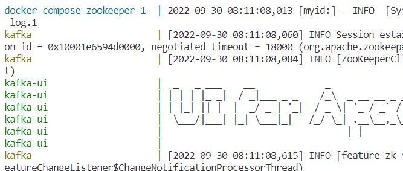
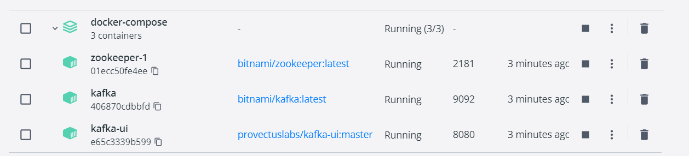

# 1. docker-compose

These solution is the most easiest and fastest way to use a kafka with some local producer/consumer and test your application, also fast to apply changes on your kafka container. It is also great for single and multiple broker.

### Steps:
These article based on this Youtube
***[Tutorial](https://www.youtube.com/watch?v=EiDLKECLcZw&ab_channel=KrisFoster)*** from KrisFoster alson contains information about Avro and producer/consumer. But I added some modifications because contains some outdated command (regarding to the `:latest` tag on kafka). 
        
> You can also download the link under the YT video, but this compose file contains an additional kafka-ui service and some minor update. These steps only works for this file.

1. Download this ***[docker-compose.yaml](../docker-compose/docker-compose.yml)*** file
1. Run `docker-compose up` command to start containers  

   ##### Docker compose cli output after up command
     

   ##### Docker compose container view on desktop client after up command
     

   > At the end with `Ctr+C` you can stop the running containers and with the `docker-compose down` can delete them.

1. create a topic on kafka instance container: 
   > `docker exec -it kafka /opt/bitnami/kafka/bin/kafka-topics.sh --create --bootstrap-server localhost:9092 --replication-factor 1 --partitions 1 --topic my-test-topic`

   > if you find somewhere else the kafka-topics `--zookeeper` flag, good to know is deprecated. CLI will throws an error, use `--bootstrap-server` parameter instead of that.

1. Now your all contaiers/services up and running:
   - [Check your kafka-ui](./kafka-ui.md)
   - Test kafka with [console](./kafka-console-producer-and-consumer.md) or from code with basic [node apps](./node-producer-and-consumer.md).
