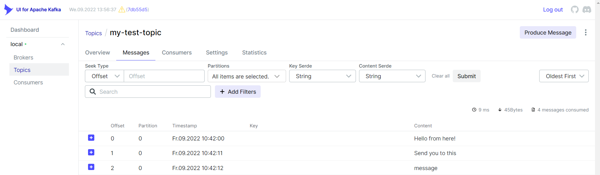
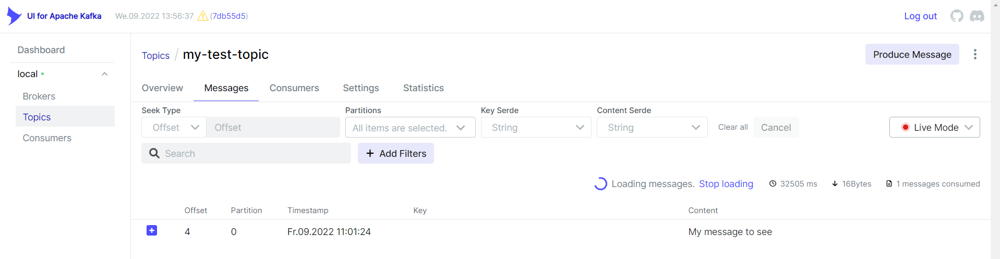

# 1. docker-compose

These solution is the most easiest and fastest way to use a kafka with some local producer/consumer and test your application, also fast to apply changes on your kafka container. It is also great for single and multiple broker.

### Steps:
These article based on this Youtube
***[Tutorial](https://www.youtube.com/watch?v=EiDLKECLcZw&ab_channel=KrisFoster)*** from KrisFoster alson contains information about Avro and producer/consumer. But I added some modifications because contains some outdated command (regarding to the `:latest` tag on kafka). 
        
> You can also download the link under the YT video, but this compose file contains an additional kafka-ui service and some minor update. These steps only works for this file.

1. Download this ***[docker-compose.yaml](../docker-compose/docker-compose.yml)*** file
1. Run `docker-compose up` command to start containers  

   ##### Docker compose cli output after up command
     

   ##### Docker compose container view on desktop client after up command
     

1. create a topic on kafka instance container: 
   > `docker exec -it kafka /opt/bitnami/kafka/bin/kafka-topics.sh --create --bootstrap-server localhost:9092 --replication-factor 1 --partitions 1 --topic my-test-topic`

   > if you find somewhere else the kafka-topics `--zookeeper` flag, good to know is deprecated. CLI will throws an error, use `--bootstrap-server` parameter instead of that.

###  kafka-console-consumer/producer 

After these, we can start test our kafka. Open a new Terminal and run these commands sequentially in this order:

   ##### Connect to the contaier terminal
   > `docker exec -it kafka bash`

   ##### Change directory to kafak scripts and list them
   > `cd /opt/bitnami/kafka/bin/ && ls`

   ##### Init a cli consumer use your previously created topic
   > `./kafka-console-consumer.sh --bootstrap-server kafka:9092 --topic my-test-topic --from-beginning`

   ##### Open a new Terminal besides the other. After this > you can type your message what you want to send and hit **Enter**
   > `./kafka-console-producer.sh --topic my-test-topic --bootstrap-server kafka:9092`

   ##### Message will appear instantly in the consumer window
   

### kafka-ui 

To open your kafka-ui just hit [localhost:8080](http://localhost:8080). You will see:
   

> navigate to the > Topics > `my-test-topic` > Messages > **Oldest First** (select from the dropdown menu at the right side)

You can examine your all messages was sent earlier

If you dont stop your producer and consumer from the previous part then select from the dropdown menu at the right side **Live Mode** instead of **Oldest First**

Send some message from producer console. Messages will appear on the ui.

## 2. strimzi operator

https://medium.com/streamingdata/running-kafka-locally-inside-kubernetes-25e84586bbf3

https://dev.to/azure/kafka-connect-on-kubernetes-the-easy-way-2co9

## 2. manual k8s

### with port-forwarding

### with headless service

# useful commands
kafka

kafka-topics --create --bootstrap-server kafka:29092 --replication-factor 1 --partitions 1 --topic gergo-test-topic
kafka-topics --list --bootstrap-server kafka:29092

kafka-console-consumer --bootstrap-server kafka:29092 --topic gergo-test-topic --from-beginning

kafka-console-producer --topic gergo-test-topic --bootstrap-server kafka:29092 --property parse.key=true --property key.separator=":"
kafka-console-consumer --topic gergo-test-topic --bootstrap-server kafka:29092 --from-beginning --property print.key=true --property key.separator=":"

kubernetes

kubectl get pods,deployments,services -n kafka

kubectl delete pods,deployments,services --all -n kafka

# about kafka
https://rmoff.net/2018/08/02/kafka-listeners-explained/

# related technologies
- [kompose](https://kompose.io/) to conert docker-compose,yml to k8s CRD
- [Helm](https://helm.sh/) package manager if want to use charts
- [kafka-ui](https://github.com/provectus/kafka-ui)

# Writing producer/consumer with node.js

## kafkajs
## node-rdkafka

    on windows machine if `npm i node-rdkafka` fails and [this](https://github.com/Blizzard/node-rdkafka#windows) also fails, then we need to be install Visual Studio with the following workloads:
    - Python development
    - Node.js development
    - Desktop development with C++
    - Linux and embedded development with C++