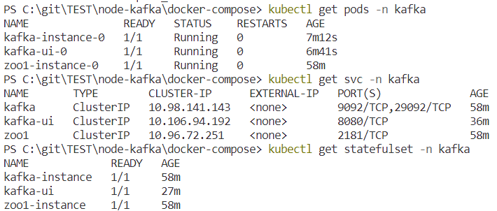

# 2. Kafka with k8s and port-forwarding

## Steps

1. Download [kafka.yaml](../kubernetes/kafka.yaml) and [zookeeper.yaml](../kubernetes/zookeeper.yaml) or navigate under kubernetes folder.

1. Create namespace `kubectl create namespace kafka`
1. Apply CRDs and add them to the previously created namespace:
    1. zookeeper with `kubectl apply -f ./zookeeper.yaml -n kafka`
    1. kafka with `kubectl apply -f ./kafka.yaml -n kafka`
    1. kafka-ui with `kubectl apply -f ./kafka-ui.yaml -n kafka`
1. Check the state of added resources:
    1. Pods `kubectl get pods -n kafka` its fine if every status on *Running* state
    1. Services `kubectl get svc -n kafka`
    1. StatfulSets (we using this resource instead of Deployment because we can keep our data after restart) `kubectl get statefulsets -n kafka`  

    
1. Create topic `kubectl exec -it -n kafka kafka-instance-0 -- bash

1. create a topic on kafka instance container: 
   > `kubectl exec -it -n kafka kafka-instance-0 -- /opt/bitnami/kafka/bin/kafka-topics.sh --create --bootstrap-server localhost:9092 --replication-factor 1 --partitions 1 --topic my-test-topic`

   > if you find somewhere else the kafka-topics `--zookeeper` flag, good to know is deprecated. CLI will throws an error, use `--bootstrap-server` parameter instead of that.`

1. Now your all resources up and running. Now you can test your kafka directly on the container from [console](./kafka-console-producer-and-consumer.md). But before able to load kafka-ui and use kafka wiht locally hosted node apps you must start some port-forwarding

    - for the ui `kubectl port-forward kafka-ui-0 8080:8080 -n kafka`
    - for the broker `kubectl port-forward kafka-instance-0 9092:9092 -n kafka`

1. Then:
    - [Check your kafka-ui](./kafka-ui.md)
    - [Run node producer and consumer](./node-producer-and-consumer.md).