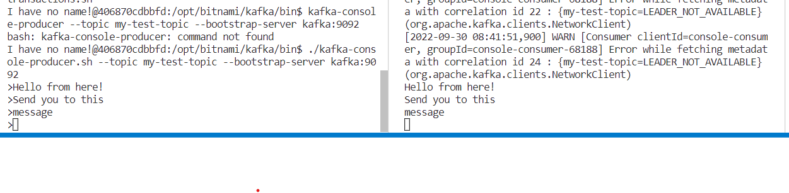

# kafka-console-consumer/producer

To test kafka, open a new Terminal and follow these steps:

   ##### Connect to the contaier terminal
   > `docker exec -it kafka bash`

   ##### Change directory to kafak scripts and list them
   > `cd /opt/bitnami/kafka/bin/ && ls`

   ##### Init a cli consumer use your previously created topic
   > `./kafka-console-consumer.sh --bootstrap-server kafka:9092 --topic my-test-topic --from-beginning`

   ##### Open a new Terminal besides the other. After this > you can type your message what you want to send and hit **Enter**
   > `./kafka-console-producer.sh --topic my-test-topic --bootstrap-server kafka:9092`

   ##### Message will appear instantly in the consumer window
   

