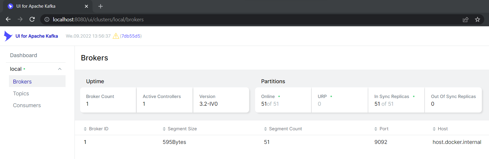
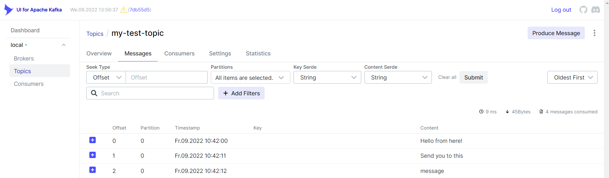
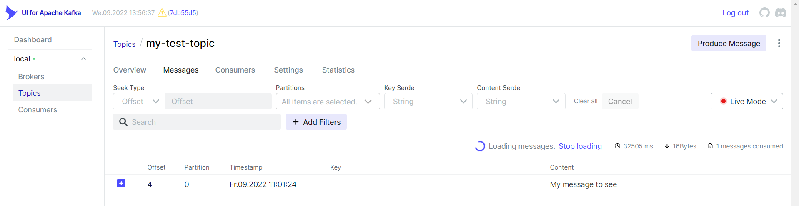

# kafka-ui

[More about this ui](https://github.com/provectus/kafka-ui)

To open your previously created kafka-ui just hit [localhost:8080](http://localhost:8080). 

You will see:
   

> navigate to the > Topics > `my-test-topic` > Messages > **Oldest First** (select from the dropdown menu at the right side)

You can examine your all messages was sent earlier

If you dont stop your producer and consumer from the previous part then select from the dropdown menu at the right side **Live Mode** instead of **Oldest First**

Send some message from producer console. Messages will appear on the ui.
